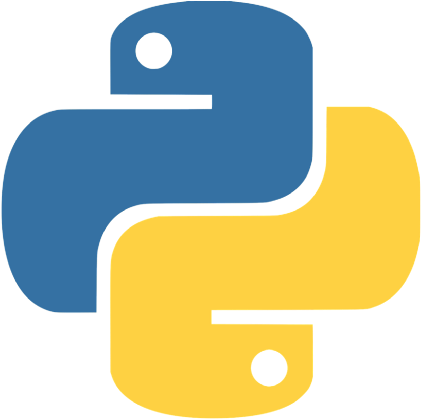
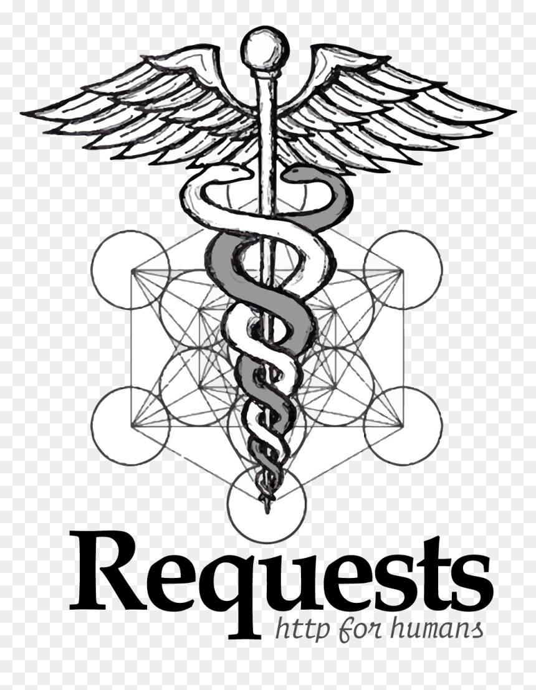
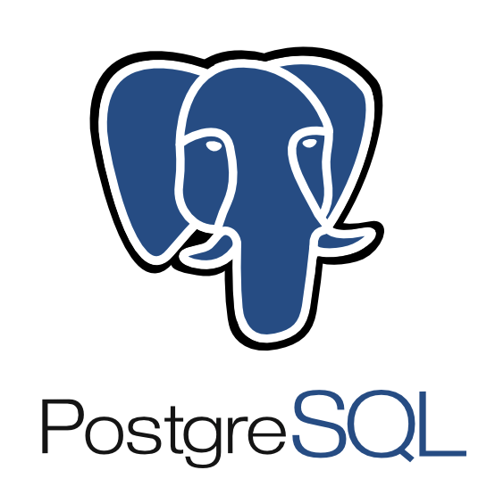

# Всем привет, я Тимур 👋

##### AQA Python 🐍

* 🔥 4+ года в тестировании
* 🐍 Пишу автотесты на Python
* ⚙️ Развиваюсь в автоматизации тестирования
* 📄 Опыт и навыки в **[резюме](https://hh.ru/resume/0fb5e475ff0dd4a76a0039ed1f586867706439)**
* 📫 Мои контакты: **[Telegram](https://t.me/Timur21vek)**, **[почта](mailto:timur.mirov21@gmail.com)**

### Python QA Auto

#### Мой стек:

| Python | PyCharm | Git | Pytest | Playwright | Requests | Docker | GitLab CI | PostgreSQL | Allure |
|--------|---------|-----|--------|-----------|----------|--------|-----------|------------|--------|
|  |  |  |  |  |  |  |  |  |  |
